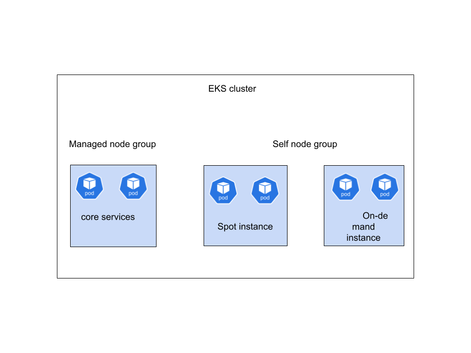

# 🏗️ System Architecture & Implementation Guide

Tài liệu này mô tả kiến trúc hạ tầng và quy trình triển khai ứng dụng NodeJS trên AWS EKS, sử dụng Karpenter để tối ưu hóa việc cấp phát tài nguyên và Cert-Manager để quản lý chứng chỉ bảo mật.

---

## 1. Tổng quan kiến trúc (High-Level Architecture)

Hệ thống được thiết kế theo mô hình **Cloud-Native**, tập trung vào khả năng tự động hóa hoàn toàn từ khâu cấp phát hạ tầng đến quản lý vòng đời ứng dụng.

### Sơ đồ luồng xử lý:
1. **Request:** Người dùng truy cập qua HTTPS (Port 443).
2. **Ingress:** Nginx Ingress Controller (chạy trên Node On-Demand) tiếp nhận request.
3. **SSL/TLS:** Chứng chỉ được tự động cấp phát bởi Let's Encrypt thông qua Cert-Manager.
4. **App:** Request được chuyển hướng đến Service NodeJS (chạy trên Node Spot).
5. **Autoscale:** Khi tải tăng, HPA tăng số lượng Pod -> Karpenter tăng số lượng Node Spot.

---

## 2. Chi tiết các thành phần hạ tầng

### 🔹 2.1. Quản lý Node với Karpenter (v1)
Chúng ta sử dụng chiến thuật **Mixed Instance Strategy** để cân bằng giữa chi phí và độ ổn định:

| NodePool | Loại Instance | OS | Tầng (Tier) | Mục đích |
| :--- | :--- | :--- | :--- | :--- |
| **nginx-od** | On-Demand | AL2023 | Frontend | Chạy Ingress Controller, yêu cầu ổn định 100%. |
| **nodejs-spot**| Spot | Bottlerocket | Backend | Chạy NodeJS App, tối ưu chi phí (tiết kiệm ~70%). |

* **Bottlerocket OS (Bonus):** Hệ điều hành mã nguồn mở tối ưu cho container, giúp giảm bề mặt tấn công và tăng tốc độ boot node.

### 🔹 2.2. Bảo mật & Chứng chỉ
* **Cert-Manager:** Tự động hóa quy trình xin, cấp mới và gia hạn chứng chỉ SSL.
* **Let's Encrypt:** Đơn vị cấp chứng chỉ (CA) miễn phí và tin cậy.
* **HTTP01 Challenge:** Được sử dụng để xác thực quyền sở hữu domain thông qua Ingress.

---

## 3. Cơ chế Autoscaling

Hệ thống sử dụng cơ chế **Double-Layer Scaling**:

1. **HPA (Horizontal Pod Autoscaler):**
   - Theo dõi Metrics Server.
   - Ngưỡng kích hoạt: `CPU Utilization > 50%`.
   - Giới hạn: `minReplicas: 2`, `maxReplicas: 10`.

2. **Karpenter Provisioning:**
   - Khi HPA tạo Pod mới nhưng Cluster hết tài nguyên, Pod sẽ ở trạng thái `Pending`.
   - Karpenter phát hiện Pod `Pending` và khởi tạo Node mới trong khoảng ~30-60 giây.

---

## 4. Kiểm thử tải (Load Testing)

Sử dụng công cụ **k6** để mô phỏng tải thực tế vào Endpoint `/time`:

- **Kịch bản:** Tăng dần từ 0 lên 200 Users trong vòng 2 phút.
- **Kết quả mong đợi:** - CPU của các Pod NodeJS tăng vượt ngưỡng.
  - Số lượng Pod tăng từ 2 lên 10.
  - Phản hồi từ API vẫn duy trì ổn định qua HTTPS.

---